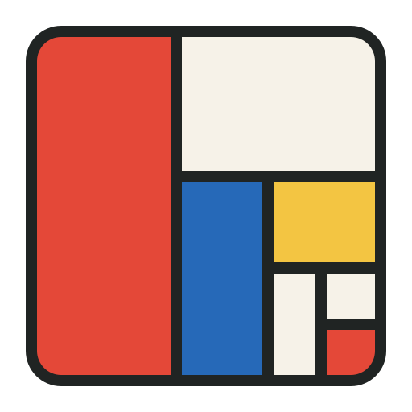

<p align="center"></p>

# tile

A focused, opinionated tiling window manager for macOS. Built for responsive keyboard and mouse
control, with a compact native Swift core, one layout per screen, and a small set of predictable rules.

## A screen, split simply

Start with one window filling the screen. The next window splits it left/right; the next splits
its focused section top/bottom. Keep going and the directions alternate, forming a spiral of nested
rectangles. Underneath, it is a simple binary tree: every section is either one window or two smaller
sections. Each split begins at 50/50, and you can resize it whenever you need more room.

New windows divide the last focused tile. **Outer** placement puts the new window toward the nearer
screen edge; **Inner** puts it toward the center. A portrait screen starts top/bottom. Focus a different
tile to grow a different branch of the tree.

- **Move without losing your size.** Horizontal moves carry the window's width; vertical moves carry
  its height. Move the wide side of a 70/30 split across the screen and the split becomes 30/70.
- **Keep layout predictable.** Moving within a parent exchanges sibling sections; moving beyond it
  swaps individual windows. Closing a tile promotes its sibling into the space.
- **Make room on a laptop.** Tiles can shrink to 160 × 100 logical points. Larger application limits
  still apply. A new window floats if its split cannot fit; existing tiles keep their allocation.
- **Use every screen.** Directional focus follows the physical display arrangement. Transfers have
  their own shortcuts. Disconnecting a screen moves its windows to a surviving screen.

## Small by design

The layout engine is a value-type binary tree, with native Accessibility adapters handling macOS
windows. The app ships as a self-contained Apple silicon binary. Its three library dependencies cover
TOML parsing, collections, and global shortcuts. A purpose-built layout model keeps the dependency
surface small. Configuration is five concepts: gaps, floating apps, insertion side, orientation, and bindings.

Try the [interactive layout prototype](dev-docs/layout-prototype.html) in Chrome to explore splits,
resizing, swaps, and screen changes. It is a standalone file. The [tiling rules](dev-docs/tiling-rules.md)
record the exact behavior, including recovery and native integration boundaries.

## Install

Release 0.6.0 supports Apple silicon Macs running macOS 27 or later. With current Homebrew:

```sh
brew tap jwshin/tap
brew trust --cask jwshin/tap/tile
brew install --cask jwshin/tap/tile
open /Applications/tile.app
```

The [tap](https://github.com/jwshin/homebrew-tap) installs the packaged app; Xcode and Swift are not required.
Release downloads and checksums are also available on [GitHub](https://github.com/jwshin/tile/releases).

This personal-use release is ad-hoc signed and **not notarized**. After the first launch attempt,
use **System Settings → Privacy & Security → Open Anyway** if macOS blocks it
([Apple's instructions](https://support.apple.com/en-us/102445)). Then grant tile Accessibility access.
Quit any existing tile or other window manager before launching the installed app. Each Mac keeps its
own `~/.tile.toml`; copy that file separately if you want matching settings.

The cask leaves your configuration in place on uninstall.

To start automatically, open the installed app and enable **Launch at login** in tile's menu.
It is off until you enable it, applies to the current user on this Mac, and is managed by macOS rather
than `~/.tile.toml`. If approval is required, use **Allow Launch at Login…** to open Login Items settings.
The menu reflects changes made in System Settings. Debug executables cannot register themselves.

## Build and run

Requires macOS 27, the macOS 27 SDK, and Swift 6.4 (see `.swift-version`). Open `Package.swift` in Xcode.

```sh
./test.sh          # Swift Testing suite and warnings-as-errors app build
./run-debug.sh     # Build and run; manages real desktop windows
./build-release.sh # Build/sign .release/tile.app without installing or launching
```

Grant Accessibility permission when prompted. Quit other window managers before starting tile.
The release bundle ID is `local.jwshin.tile`; debug is `local.jwshin.tile.debug`.
The release script uses ad-hoc signing unless `TILE_CODESIGN_IDENTITY` is set; ad-hoc rebuilds may
require renewing Accessibility permission. Stop any older unbundled debug process before launching.

## Configuration

Use **Open config** in the menu to create `~/.tile.toml` from [the defaults](resources/default-config.toml).
Reload from the menu or with `alt-shift-r`. Invalid configuration preserves the working configuration.

```toml
gap = 8
new-window-placement = 'outer' # outer | inner
root-orientation = 'auto'     # auto | horizontal | vertical
floating-apps = ['com.apple.finder'] # exact bundle IDs; default []
```

`gap` controls all inner and outer spacing. Root orientation follows usable screen shape in Auto;
`toggle-orientation` sets an in-memory override for the selected screen. Disconnecting discards that override.
Placement affects future insertions, including retiling, returning windows, and transfers.

`floating-apps` makes newly detected windows from matching apps float by default. Matching is exact
and case-sensitive; use bundle IDs rather than display names or wildcard patterns. Put the list above
`[bindings]`. Reload changes future classifications, including windows rediscovered after restarting tile;
existing windows keep their layout. `toggle-floating` can still tile a matching resizable window when it fits,
and that manual choice survives transfers and minimize/restore. Popups remain unmanaged.

Omit `[bindings]` to keep the default shortcuts. An explicit table replaces the whole set; an empty
one disables shortcuts. Keys use fixed QWERTY positions, and each shortcut names one action:

```toml
[bindings]
alt-h = 'focus-left'
alt-equal = 'grow-width'
alt-tab = 'next-monitor'
alt-shift-tab = 'move-to-next-monitor'
```

**Migration:** `floating-apps` remains supported. Replace `join-*` or `flatten-layout` bindings. Manual floating
and native dialog classification remain. Configuration is intentionally incompatible with the old
container model; unknown settings or actions reject the reload as a whole.

| Actions | Behavior |
| --- | --- |
| `focus-left/down/up/right` | Directional tile focus, including across screens |
| `move-left/down/up/right` | Section/window move with size preservation; nudge a float |
| `swap-left/down/up/right` | Individual-window swap, preserving the selected dimension |
| `grow-width`, `shrink-width`, `grow-height`, `shrink-height` | Resize the nearest split on that axis by 50 points, clamped to minimums |
| `grow`, `shrink` | Resize the immediate split by 50 points |
| `toggle-orientation` | Flip the screen root and all alternating subdivisions |
| `toggle-floating` | Float/retile an eligible window through normal insertion |
| `balance-sizes` | Reset splits to 50/50, then enforce minimums |
| `fullscreen` | Toggle filling the monitor's available area, retaining its tile |
| `close` | Close the focused window |
| `next-monitor`, `previous-monitor` | Cycle screens with wrapping |
| `left/down/up/right-monitor` | Select a screen in that physical direction |
| `move-to-next-monitor`, `move-to-previous-monitor` | Transfer and focus, cycling with wrapping |
| `move-to-monitor-left/down/up/right` | Transfer and focus in that physical direction |
| `toggle-tiling`, `reload-config` | Enable/disable management; reload preferences |

The slash-separated names in the table denote individual actions (for example, `focus-left`).

| Default shortcut | Action |
| --- | --- |
| `alt-h/j/k/l` | Focus left/down/up/right |
| `alt-shift-h/j/k/l` | Move left/down/up/right |
| `alt-ctrl-h/j/k/l` | Swap individual windows |
| `alt-minus/equal` | Shrink/grow width |
| `alt-ctrl-minus/equal` | Shrink/grow height |
| `alt-shift-equal` | Balance split sizes |
| `alt-slash` | Flip screen orientation |
| `alt-shift-space` | Toggle floating |
| `alt-f` | Toggle filling the available screen area |
| `alt-tab` | Focus next monitor |
| `alt-shift-tab` | Transfer to next monitor |
| `alt-shift-r` | Reload config |

## Mouse and native lifecycle

Drag within the immediate parent to swap sibling sections; cross its boundary to swap individual windows.
Changes are live. Once a drag crosses a parent boundary, it keeps swapping individual windows until release.
The pointer must leave a target region before another swap. Escape cancels the gesture.

Hovering another screen shows an outline; releasing transfers using normal insertion. Source-screen swaps
made during that gesture are discarded on a cross-screen drop. Floating windows remain freely draggable
and resizable. Native tiled resizing adjusts the corresponding binary dividers.

Minimized, hidden, and native fullscreen windows leave the tree and reinsert on return. Floating windows
remain floating. In-memory snapshots support recovery from temporary Accessibility observation loss.
Restart rebuilds from discovered windows rather than writing layouts to disk.

The menu provides enable/disable, config access, permission status, state diagnostics, and quit. Disabled
shortcuts are unregistered; re-enable from the menu. Quitting leaves window positions as they are.

If Tile seems to lose a window, use **Open diagnostics…** before restarting. The report captures all
tracked windows (including floats and temporarily unavailable windows), layout trees, focus,
restoration snapshots, and recent refresh activity. It compares Tile's model with its Accessibility
cache, a fresh AX window list, and macOS's on-screen window list without refreshing or repairing the
layout. Slow Accessibility threads are marked unavailable after three seconds. **Capture again**
takes a new snapshot; **Copy report** and **Save report…** export it for investigation. App names,
bundle IDs, window IDs, and geometry are included; window titles and document contents are omitted.
The view is available while tiling is disabled or Accessibility permission is missing.

## Source map

- `Sources/tile`: SwiftUI app entry point.
- `Sources/AppBundle/tree`: pure binary layout, display/window state, native app/window adapters.
- `Sources/AppBundle/layout`: action sessions, reconciliation, native frame application.
- `Sources/AppBundle/mouse`: drag/resize transactions and destination preview.
- `Sources/AppBundle/command`: keyboard and menu actions.
- `Sources/AppBundle/config`: TOML preferences and shortcut registration.
- `Sources/AppBundle/ui`: menu and error messages.
- `Sources/Common`: geometry and small shared utilities.
- `Sources/AppBundleTests`: layout, focus, gesture, lifecycle, configuration, and adapter tests.
- `axDumps`: native window-classification fixtures.

See [architecture](dev-docs/architecture.md) and [development](dev-docs/development.md).
tile grew from [AeroSpace](https://github.com/nikitabobko/AeroSpace), with its layout and interaction
model rebuilt around alternating binary splits. Original copyright and third-party licenses remain in
`LICENSE.txt` and `legal/`.

The logo echoes those splits with a Mondrian-inspired palette; a monochrome version marks the menu bar.
Its editable vector is
[resources/tile.svg](resources/tile.svg); run `swift script/render-logo.swift` on macOS to regenerate
it, a PNG preview, and the app icon from the same geometry.
