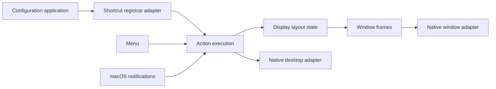

# Architecture

The app is one process. Keyboard shortcuts invoke typed internal commands directly; there is no CLI or socket server.

Domain terms are defined in [CONTEXT.md](../CONTEXT.md).

`ConfigurationApplication` owns effective preferences, enabled state, and shortcut registration lifetime.
Its internal `ShortcutRegistrar` seam has native HotKey and recording test adapters. Parsing errors preserve
both preferences and registrations. Reload while disabled updates preferences without registering shortcuts;
re-enabling registers the latest bindings. UI callers present returned diagnostics.

`ActionExecution.execute` is the interface used by keyboard and menu callers. It owns native focus import,
command execution, frame writes, native focus updates, and background refresh scheduling.
Its internal desktop adapter supplies native observations and reconciliation; tests substitute observations
while exercising the same session and layout implementation. Foreground sessions cancel background refresh.
Mouse and startup sessions use the same owner. Tree algorithm tests keep a smaller test-only entry point.

`DisplayLayoutState` owns display layouts, window identity, logical focus, native focus history, restoration
snapshots, and native window kinds (floating, popup, minimized, hidden, fullscreen). Each test can create fresh state. Layout mutations invalidate
restoration through the owner, and window disappearance/restoration uses the same lookup in production and tests.

`Sources/tile/TileApp.swift` creates the menu and message scenes and calls `initAppBundle`.
`Package.swift` defines the executable, internal AppBundle and Common modules, PrivateApi bridge, and tests.
The release script packages the executable and default configuration into a local macOS app bundle.

## Display layouts

`Workspace` is retained as an internal layout container. There is one per connected display, indexed by
macOS display ID rather than screen coordinates or user-specified workspace names. Display movement
updates geometry without exchanging trees. Disconnecting merges the missing display's tiling subtree,
floating windows, and native fullscreen/hidden windows into the main display. A newly connected display
gets an empty tree. A transient zero-display snapshot does not destroy existing layouts.

There is no inactive-workspace hiding. All registered display layouts are visible. Frozen focus resolves
references to disconnected displays back to the main display. Removing a display invalidates the
closed-window restoration snapshot so unlocking cannot restore an obsolete display arrangement.

## Commands and configuration

Bindings store a typed `Action` selected by exact name. `Action.swift` maps the finite action set to small
internal commands; there is no argument parser, command sequence, window-ID target, or monitor-pattern matching.
Commands operate on the current focus. Action execution invalidates restoration when needed and applies
frames after each action, including failures. Monitor navigation retains directions and wrapping next/previous;
moving a window between monitors always follows it. Directional window focus stops at display edges.

Configuration has only `gap`, `floating-apps`, and `[bindings]`. All displays use the same inner/outer gap,
with 8 points as the default. Key names use fixed QWERTY positions. Omitting the binding table inherits defaults; an explicit table replaces them.
Parsing collects diagnostics and rejects the entire reload on error. The config path is fixed to
`~/.tile.toml`; the internal URL override exists only for bundled startup validation and tests.

## Binary layout module

`BinaryLayout` is a value type with a private recursive node: a window ID, or a split with an axis,
ratio, and exactly two children. An empty layout has no root. Callers insert, remove, move, swap,
toggle, resize, balance, merge, or request frames; they cannot edit node structure directly.
There are no parent pointers, adaptive weights, general-purpose container kinds, or normalization passes.

Insertion splits a target leaf 50/50, choosing an axis from its current rectangle unless a move specifies
a direction. Axis and ratio persist across later frame calculations. Removal collapses the parent to its
remaining child. Balance distributes each split by descendant leaf count, so gap-free leaves have equal
areas; gaps can introduce small differences. Manual resizing clamps ratios to 10–90%.

`Workspace` owns a binary layout and recent-window IDs. `Window` is a registered native/test object,
not a tree node. `DisplayLayoutState.place` updates both membership and tiling, while special native states
live outside the binary tree. A minimized window retains its home display and previous tiled/floating kind.
Monitor removal joins the two display trees under a new split without altering either subtree.

Restoration stores binary layout values and window kinds directly. As windows return in any order, the
saved tree is pruned to known leaves; later arrivals recover the original splits and ratios. Newly discovered
windows outside the snapshot are retained. Explicit layout edits and monitor removal invalidate the snapshot.

Directional focus ranks window rectangles (perpendicular overlap, forward distance, perpendicular distance,
then window ID). Floating windows participate without being inserted into the tiling tree. Move reinserts
beside the directional neighbor; swap exchanges leaf IDs. `join-*` and `flatten-layout` are removed,
and `toggle-split` replaces `toggle-orientation` without compatibility aliases.

`MouseTiling` stores one gesture's starting layout and frame. Resizes apply absolute gesture deltas to
the original dividers. During dragging, center hits swap within a display, edge hits reinsert, and
cross-display hits transfer membership. Each edit updates the expected layout and display, keeping the
gesture active. The pointer must leave the previous target region before another edit, preventing
repeated rearrangement as tiles move underneath it. Release applies any final move and ends the gesture.
A gesture is rejected when its window, layout, geometry, or gap has changed externally;
keyboard/menu actions cancel the gesture. Mouse callbacks and commands both use action execution.

## Native adapter seam

MacApp serializes Accessibility operations on a dedicated run-loop thread per application. Main-actor
refresh sessions reconcile native events with the mutable model. MacWindow bridges native window IDs
and registered window objects. Keep cancellation, window classification, and lock-screen restoration when changing policy.
Tests use TestWindow and injectable monitor snapshots to verify policy without operating the real desktop.
Model suites remain serialized because application-level accessors and native test fixtures still share state.
Configuration application and display layout state can also be constructed independently inside a test.

## Platform baseline

The executable and release bundle require macOS 27. UI models use Observation and are isolated to the main actor.
The diagnostics window uses SwiftUI window controls and selectable read-only text; its Close button handles Return.
Cancellation uses a `Synchronization.Atomic<Bool>` flag. Native `Task` initialization preserves actor context without
an extra wrapper. Accessibility callbacks still use a dedicated run-loop thread per app, including thread-affine cleanup.
