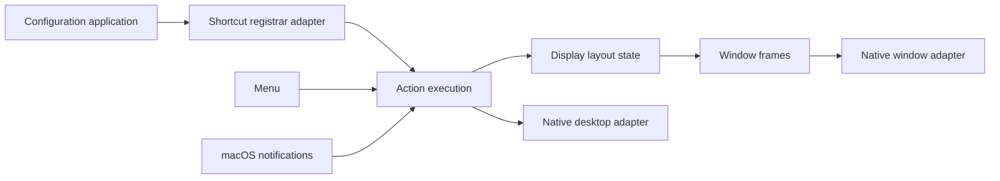

# Architecture

The app is one process. Keyboard shortcuts invoke typed internal commands directly; there is no CLI or socket server.

Domain terms are defined in [CONTEXT.md](../CONTEXT.md).

`ConfigurationApplication` owns effective preferences, enabled state, and shortcut registration lifetime.
Its internal `ShortcutRegistrar` seam has native HotKey and recording test adapters. Parsing errors preserve
both preferences and registrations. Reload while disabled updates preferences without registering shortcuts;
re-enabling registers the latest bindings. UI callers present returned diagnostics.

`ActionExecution.execute` is the interface used by keyboard and menu callers. It owns native focus import,
command execution, frame writes, native focus updates, and background refresh scheduling.
Its internal desktop adapter supplies native observations and reconciliation; tests substitute observations
while exercising the same session and layout implementation. Foreground sessions cancel background refresh.
Mouse and startup sessions use the same owner. Tree algorithm tests keep a smaller test-only entry point.

`DisplayLayoutState` owns display layouts, window identity, logical focus, native focus history, restoration
snapshots, its active gesture, and native window kinds (floating, popup, minimized, hidden, fullscreen). Each test can create fresh state. Layout mutations invalidate
restoration through the owner, and window disappearance/restoration uses the same lookup in production and tests.

`Sources/tile/TileApp.swift` creates the menu and message scenes and calls `initAppBundle`.
It also creates a separate state-diagnostics scene. `DiagnosticsModel` freezes stored layout/focus/
restoration state before requesting read-only observations on existing per-app AX threads. It never
enters `ActionExecution` or registers native windows. The report compares model IDs, cached IDs, fresh
AXWindows IDs, and on-screen Window Server entries. A three-second deadline retains partial evidence;
cancelled/stale callbacks cannot overwrite a newer capture. `ActionExecution` retains the last 50
session outcomes and window-ID deltas in memory. Diagnostics omit window titles and document contents.
`Package.swift` defines the executable, internal AppBundle and Common modules, PrivateApi bridge, and tests.
The release script packages the executable and default configuration into a local macOS app bundle.

## Display layouts

`Workspace` is retained as an internal layout container. There is one per connected display, indexed by
macOS display ID rather than screen coordinates or user-specified workspace names. Display movement
updates geometry without exchanging trees. Disconnecting inserts its tiled windows individually on the most recently focused remaining screen
(or the main screen), moving floating and unavailable windows to that screen as well. A newly connected display
gets an empty tree. A transient zero-display snapshot does not destroy existing layouts.

There is no inactive-workspace hiding. All registered display layouts are visible. Frozen focus resolves
references to disconnected displays back to the main display. Removing a display invalidates the
closed-window restoration snapshot so unlocking cannot restore an obsolete display arrangement.

## Commands and configuration

Bindings store a typed `Action` selected by exact name. `Action.swift` maps the finite action set to small
internal commands; there is no argument parser, command sequence, window-ID target, or monitor-pattern matching.
Commands operate on the current focus. Action execution invalidates restoration when needed and applies
frames after each action, including failures. Monitor navigation retains directions and wrapping next/previous;
moving a window between monitors always follows it. Directional tile focus crosses screens in their physical arrangement without wrapping.

Configuration has `gap`, `floating-apps`, `new-window-placement`, `root-orientation`, and `[bindings]`. All displays use the same inner/outer gap,
with 8 points as the default. Key names use fixed QWERTY positions. Omitting the binding table inherits defaults; an explicit table replaces them.
Parsing collects diagnostics and rejects the entire reload on error. The config path is fixed to
`~/.tile.toml`; the internal URL override exists only for bundled startup validation and tests.

## Binary layout module

`BinaryLayout` is a value type with a private recursive node: a window ID, or a ratio and exactly
two children. The root orientation determines each split's direction by depth. Callers can insert,
remove, swap, move, resize, recover, balance, or request geometry without editing nodes. Empty layouts
have no root; removal promotes a sibling. There are no parent pointers, adaptive weights, or normalization passes.
Parent and sibling-region queries belong to this module, so gesture handling does not interpret tree paths.

Insertion checks a local 50/50 split using Outer/Inner placement. Failure leaves the tree unchanged;
the owner floats the arriving window. Minimum section dimensions are calculated bottom-up. Interactive
resize clamps the nearest matching divider while retaining child ratios. Recovery after unavoidable
geometry/topology changes keeps valid ratios, clamps the rest, then removes least-recently-focused tiles
until the tree fits. `Workspace` turns those removals into floating membership.

Moves perform a structural exchange and solve for an exact selected width/height as one transaction.
Bounds propagate upward from that leaf; allocation proceeds downward, adjusting destination and ancestor
dividers. Other subtrees retain ratios unless their minimums require adjustment. If no valid allocation
exists, the original value tree is retained. Both the native model and prototype implement this rule.

`Workspace` owns the tree, per-screen root override, and recent-focus history. `Window` is a registered
native/test object with a kind, minimum size, assigned screen, and focus timestamp. `DisplayLayoutState.place`
is the shared insertion path for creation, retiling, native return, and screen transfer. Minimized/hidden/
native fullscreen windows keep their assigned screen and resume kind outside the tree.

Restoration keeps in-memory layout values and window kinds. Returning identities reconstruct the saved
tree with missing leaves pruned; additional windows are retained. Explicit layout edits and monitor removal
invalidate snapshots. Startup rebuilds discovered windows; no persistent layout store is added.

Focus ranks tile rectangles by perpendicular overlap, forward distance, perpendicular distance, then ID.
Floating windows can supply a focus origin but are not directional targets. Move prefers the immediate
sibling section, otherwise an individual tile outside the parent on the same screen. Explicit swap always
exchanges individual windows. The `join-*` and `flatten-layout` actions are removed.

`DisplayLayoutState` owns one private `MouseTiling` instance, including its original and expected layouts,
manipulated window identity, transfer preview, and cancellation-until-release state. Pointer updates and
release enter through the state owner and invalidate only its restoration history. Membership changes,
window constraints, and monitor reconciliation cancel that owner's gesture before mutation. Frame writes
and size feedback consult the same owner's manipulated window, so equal IDs in another state do not interfere.
A `PointerAdapter` supplies pressed-button state and renders previews; native and recording test adapters
exercise the same gesture implementation. The UI adapter keeps native event translation outside the model.
Native resize deltas apply to the original snapshot. Same-screen swaps update live, with a target-region latch and sticky individual-window mode
once a parent boundary is crossed. Another screen receives only a preview until release. A cross-screen
drop restores the original source tree before transferring once. Escape or an independent lifecycle/action
change cancels before mutation. Stale gestures never overwrite unrelated edits or resurrect closed windows.
A non-activating `NSPanel` owned by the native pointer adapter renders the destination outline. Input
continues through the normal native window. Release clears cancellation state even when tiling has been disabled.

The retained [prototype](layout-prototype.html) and [tiling rules](tiling-rules.md) are the executable reference
and authoritative policy document. Keep both synchronized with native policy changes.

## Native adapter seam

MacApp serializes Accessibility operations on a dedicated run-loop thread per application. Main-actor
refresh sessions reconcile native events with the mutable model. MacWindow bridges native window IDs
and registered window objects. Keep cancellation, window classification, and lock-screen restoration when changing policy.
Notification setup is best effort and does not gate app/window registration. Successful subscriptions
remain active when another notification fails; readable AXWindows and native focus still drive
discovery during ordinary refreshes. An independent Foundation port keeps each AX thread alive even
when observer creation fails. Diagnostics retain app/window notification setup errors. No periodic
fallback polling is added, so unsupported notifications rely on subsequent desktop/action refreshes.
Initial classification checks `floating-apps` against the raw bundle identifier after popup filtering. The list is a default for newly detected windows; reload does not rewrite existing membership, and manual tiling survives transfers and temporary exclusion.
Resizable capability is queried through Accessibility, with unknown capability allowed. After successful
size writes, two consistent returned sizes more than 32 points larger can raise a window's minimum;
smaller discrepancies, such as cell snapping, are ignored; stale requests, floating
windows, active drags, and expanded windows are ignored. These limits are learned only in memory.
Tests use TestWindow and injectable monitor snapshots to verify policy without operating the real desktop.
Model suites remain serialized because application-level accessors and native test fixtures still share state.
Configuration application and display layout state can also be constructed independently inside a test.

## Platform baseline

The executable and release bundle require macOS 27. UI models use Observation and are isolated to the main actor.
The configuration-error window uses SwiftUI window controls and selectable read-only text; its Close button handles Return.
The separate state-diagnostics window provides capture, copy, and save controls with selectable report text.
Cancellation uses a `Synchronization.Atomic<Bool>` flag. Native `Task` initialization preserves actor context without
an extra wrapper. Accessibility callbacks still use a dedicated run-loop thread per app, including thread-affine cleanup.
